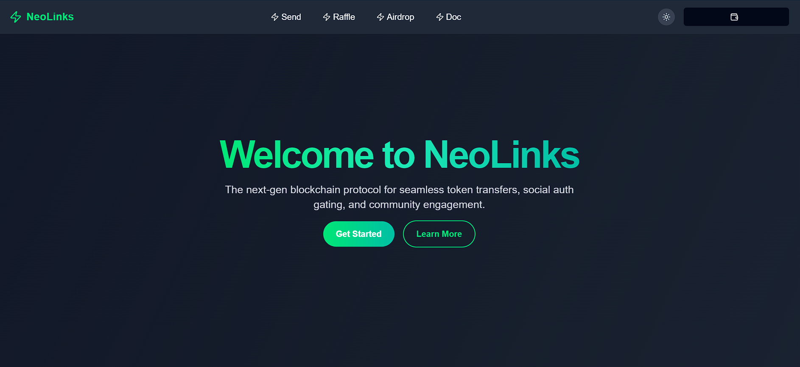
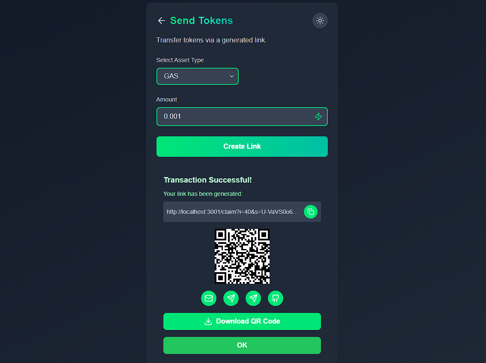
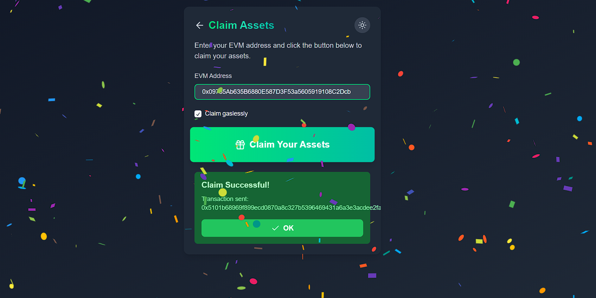
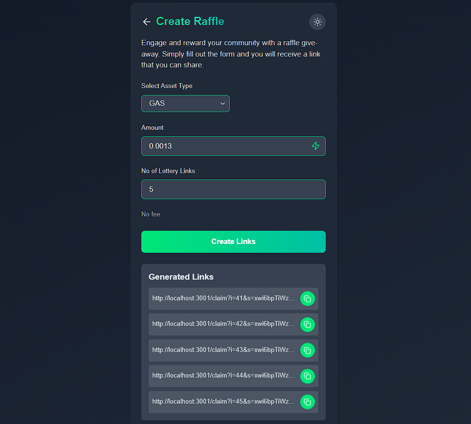
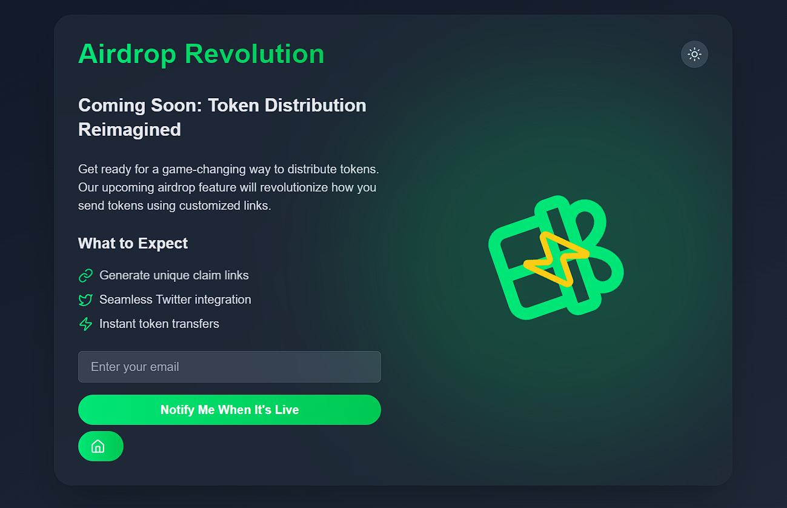
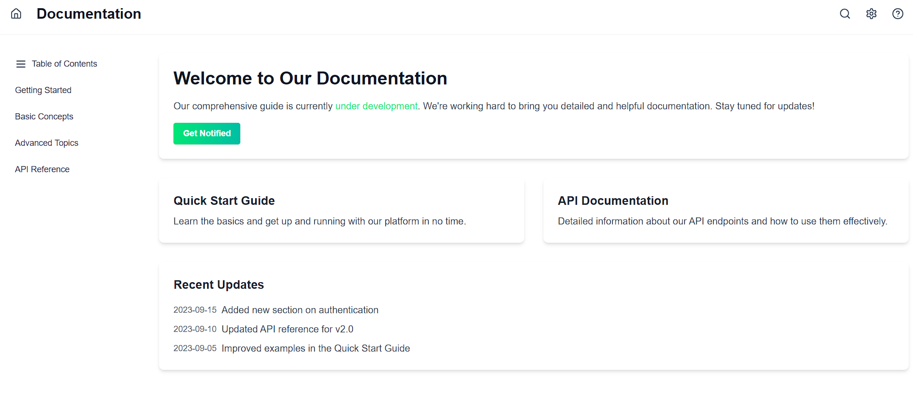

# 🚀 **Blockchain Payment Simplified** 🌐

<div align="center">
  
</div>

## **Introduction**

Tired of long wallet addresses? Say goodbye to the hassle of sharing wallet addresses and embrace an easy way to send and receive payments on the blockchain using just a **link**!

**We make blockchain payments effortless**:
- Send tokens with a simple link, no need to know the recipient's wallet address.
- Recipients claim tokens **gaslessly** on their EVM wallets without needing to connect their wallet.

✨ **Linking people to crypto** has never been this easy!

---

## **Core Features**

- **Send Payment with a Link** 💸  
  Just go to the **Send Tokens** page, select your preferred asset, enter the amount, and generate a unique payment link. The recipient can claim the tokens without connecting their wallet.  
  
  <div align="center">
    
  </div>

- **Gasless Claims** ⚡  
  Recipients can claim tokens by simply pasting their EVM wallet address, without the need for gas fees or wallet connection.  
  
  <div align="center">
    
  </div>

- **Create a Raffle** 🎟️  
  Engage with your community by setting up raffles! Token holders can participate for a chance to win crypto.  
  
  <div align="center">
    
  </div>

- **Social Auth Linked Airdrop** - Coming soon... ✈️  
  Distribute tokens seamlessly through airdrops, making it easy to reward your users.  
  
  <div align="center">
    
  </div>

- **Documentation** 📄 _Coming Soon_  
  Stay tuned! We'll be adding comprehensive documentation for developers and users soon.  
  
  <div align="center">
    
  </div>

---

## **How to Set Up Locally**

Setting up the project is a breeze! Just follow these steps:

1. **Clone the repo**  
   ```bash
   git clone https://github.com/yourusername/your-repo-name.git
   cd your-repo-name
   ```

2. **Install dependencies**  
   Make sure you have Node.js installed. Then, install the required packages:  
   ```bash
   npm install
   ```

3. **Set up environment variables**  
   Create a `.env.local` file in the root directory with the following content:  
   ```
   NEXT_PUBLIC_WALLET=<your-wallet>
   NEXT_PUBLIC_CONTRACT_ADDRESS=<contract-address>
   ```

4. **Configure WAGMI**  
   Update the contract address in the `wagmi.config.js` file with your smart contract details.

5. **Run the development server**  
   Start your project with:  
   ```bash
   npm run dev
   ```

6. **Open the app**  
   Go to `http://localhost:3000` in your browser, and you're all set!

---

## **How it Works**

### **Sending Tokens:**
1. Go to our **Send Tokens** page.
2. Select the token/asset you want to send.
3. Enter the amount.
4. Generate a payment link and share it with the recipient.

### **Claiming Tokens:**
1. Paste your EVM address on the claim page.
2. **No need to connect your wallet** or pay gas fees to claim!

### **Create a Raffle:**
1. Engage your users by creating a raffle, where participants can join using their tokens.

---

## **Other Info**

- **Built with**: Next.js, WAGMI, and Solidity.
- **Supports**: EVM-based wallets.

Join us on our mission to **link people to crypto**! 💪

---

## **Contributing**

We welcome all contributions! Feel free to open a pull request or issue.

---

## **License**

This project is licensed under the MIT License.

---

Happy hacking! 👨‍💻👩‍💻

